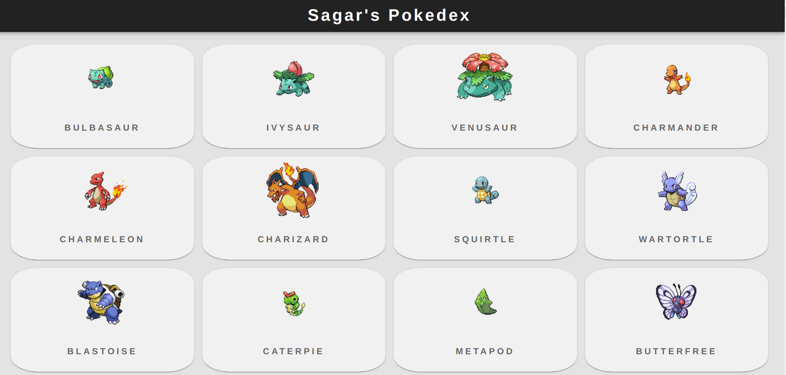
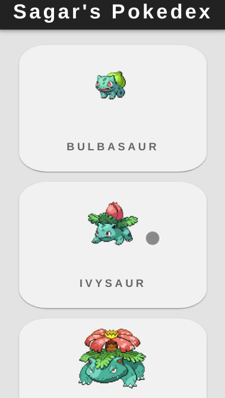

**This project is hosted at:** <https://zoyrosaur.netlify.app/>

# Pokedex

### On larger screens

### On smaller screens

> API used for the project
> <https://pokeapi.co/api/v2/pokemon?limit=100>

#### Steps to download and run on your local machine

- Clone this repository to your local machine

- Change into the directory of the repository

- Run `npm install`, it will install all the required dependencies

- Then run npm start, it will run the project locally to your computer
